## Your First Workspace

When you launch Krillnotes for the first time, you're greeted with the welcome screen. It has one instruction: use the **File** menu to create or open a workspace.

A **workspace** is a single `.krillnotes` file on your disk — a self-contained SQLite database holding all your notes and scripts. You can have as many workspaces as you like and open multiple at once, each in its own window.

### Creating and opening workspaces

The **File** menu is where all workspace operations live.

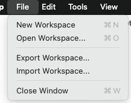

- **New Workspace** (`⌘N`) — creates a new `.krillnotes` file in your default workspace directory.
- **Open Workspace** (`⌘O`) — opens a picker showing your recently used workspaces.
- **Export Workspace** — saves the current workspace as a `.krillnotes` archive (notes + scripts). You will be prompted whether to protect the export with a password.
- **Import Workspace** — restores a workspace from a previously exported `.krillnotes` archive.

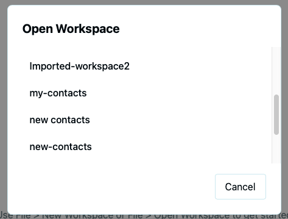

When creating a new workspace you are prompted to set an optional password.

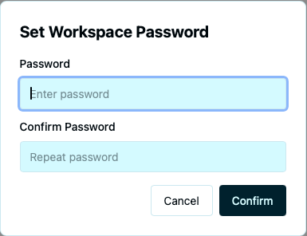

Enter and confirm a password, then click **Confirm**. The workspace is encrypted on disk; you will be prompted for the password each time you open it. Leave both fields blank and click **Confirm** to skip encryption.

When opening a password-protected workspace, a prompt shows the workspace name and asks for its password.

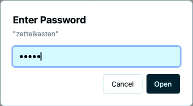

### Settings

Go to **Edit → Settings** to configure your workspace preferences.

- **Default Workspace Directory** — new workspaces are created here automatically. Click **Browse…** to change it.
- **Remember workspace passwords for this session** — when checked, passwords are kept in memory until the app closes. Off by default.

The **Appearance** section lets you choose a colour mode (**Light**, **Dark**, or **System**) and assign separate themes for light and dark modes. Click **Manage Themes…** to create or import custom themes.

---

## The Main Window

Once a workspace is open, the main window has two panels: the **note tree** on the left and the **detail panel** on the right.

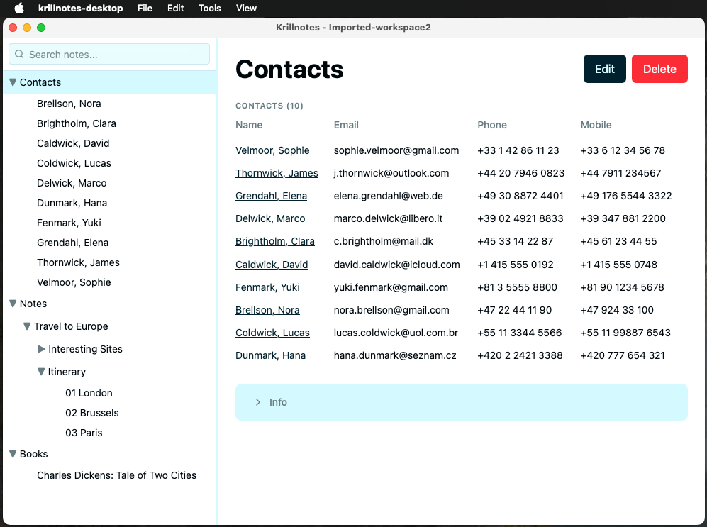

- **Left panel** — the full tree of all notes in the workspace. Click any note to select it; the detail panel updates immediately. Use the search bar at the top to filter by title or field content.
- **Right panel** — shows the selected note. The content depends on the note type: a contacts folder shows a summary table; an individual contact shows its fields.

You can drag the divider between the two panels to resize them.

### Reorganising notes

Drag any note in the tree to move it. A blue indicator line shows where it will be dropped.

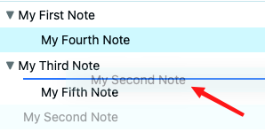

### Keyboard navigation

| Key | Action |
|-----|--------|
| `↑` / `↓` | Move between notes |
| `→` | Expand selected note |
| `←` | Collapse selected note |
| `Enter` | Edit selected note |

---

## Adding Notes

Right-click any note in the tree to open the context menu.

- **Add Child** — adds a new note nested one level deeper.
- **Add Sibling** — adds a new note at the same level, directly below.
- **Edit** — opens the selected note for editing.
- **Copy Note** — copies the note to the clipboard.
- **Paste as Child / Paste as Sibling** — pastes a copied note at the chosen position.

Choosing **Add Child** or **Add Sibling** opens the Add Note dialog. Select the **Note Type** and click **Create**.

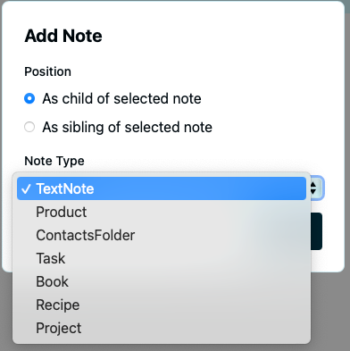

The built-in types are: **TextNote**, **ContactsFolder**, **Contact**, **Task**, **Project**, **Recipe**, and **Product**. Scripts can define additional types.

### Script-defined menu actions

Scripts can extend the context menu with custom actions for a specific note type. These appear between the standard items and **Delete**.

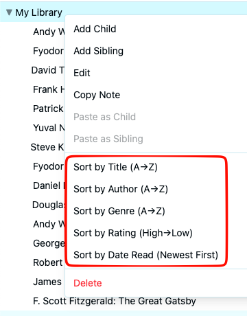

For example, a Library script might add sort actions — *Sort by Title*, *Sort by Author*, *Sort by Rating* — that operate on that note's children. What actions are available depends entirely on the scripts installed in the workspace.

---

## Anatomy of a Note

Every note in Krillnotes is made up of the same three building blocks.

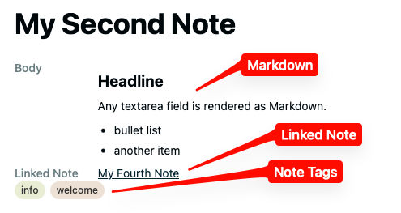

- **Markdown** — any `textarea` field (such as *Body*) is rendered as Markdown. You can use headings, bullet lists, bold, links, and more.
- **Linked Note** — a field that references another note in the workspace by title. Clicking the link in the detail view jumps directly to that note.
- **Note Tags** — free-form labels attached to a note for organisation and filtering.

The exact fields a note has depend on its type, which is defined by a script.

---

## Tags

Tags are free-form labels you can attach to any note. They appear as chips in the edit form and in the detail view, and are collected in a **tag cloud** at the bottom of the tree.

### Editing tags

Open a note for editing. The tag bar appears directly below the title — existing tags show with an **×** button to remove them, and the **Add tag…** input lets you type a new one.

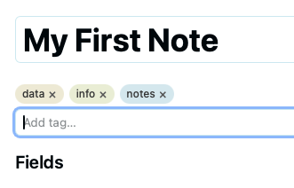

Press `Enter` or comma to confirm a tag. Tags are saved with the note.

### Tag cloud

The tag cloud at the bottom of the tree panel shows every tag used in the workspace.

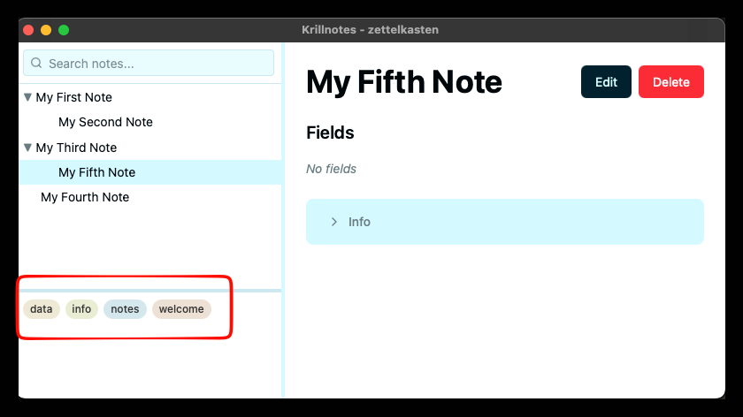

Click a tag in the cloud to filter the tree to notes that carry that tag. Click it again to clear the filter.

---

## Note Links

A *Linked Note* field lets you attach a reference to another note in the workspace. When viewing the note, the linked title appears as a clickable link that jumps directly to that note.

### Adding a link

In edit mode, click the **Linked Note** field and start typing. An autocomplete list of matching note titles appears.

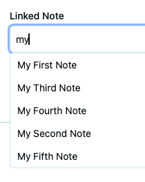

Select a note from the list to set the link.

### Removing a link

To clear a link, click the **×** button at the end of the Linked Note field.

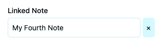

---

## Contacts

The Contacts script provides two types that work together: a **ContactsFolder** that holds the list and renders a summary table, and individual **Contact** notes beneath it.

### Viewing contacts

Selecting the folder shows all contacts in a table with name, email, phone, and mobile.

Click any name in the table to jump directly to that contact.

### Viewing a contact

Selecting an individual contact shows all its fields in the detail panel.

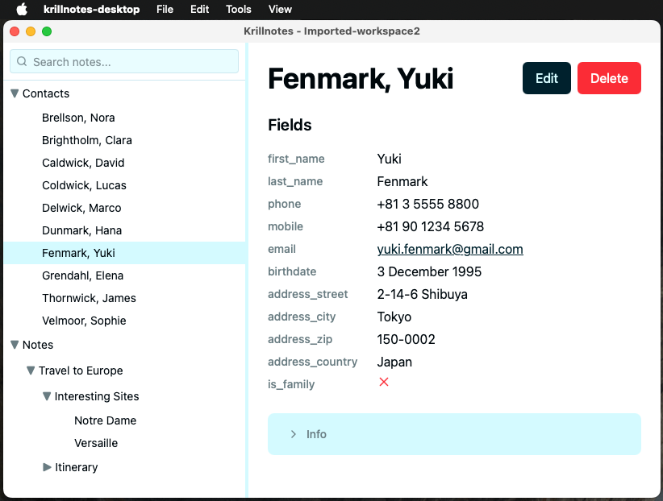

The title (`Fenmark, Yuki`) is derived automatically from the `last_name` and `first_name` fields by an `on_save` hook in the Contacts script — you never type it manually.

### Editing a contact

Click **Edit** to open the edit form. All fields are editable. Required fields (`first_name`, `last_name`) are marked with a red asterisk.

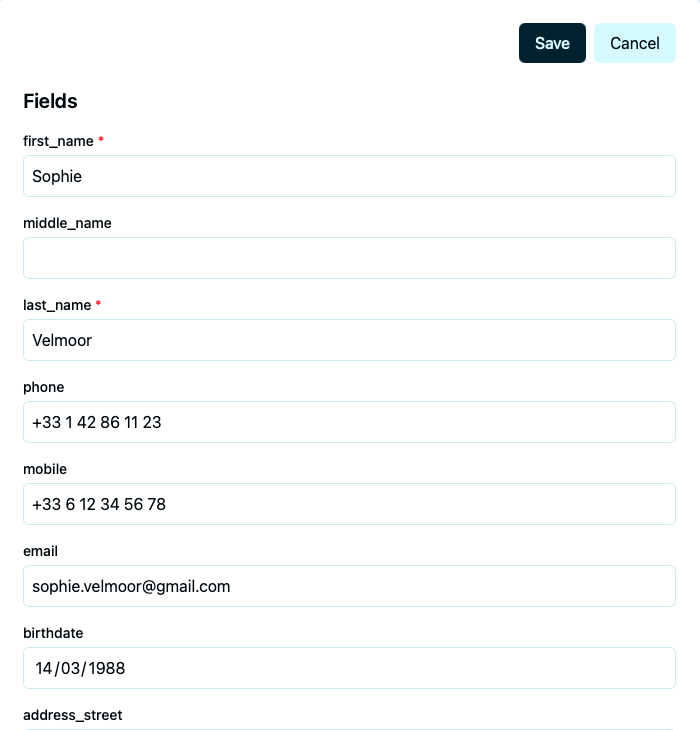

Click **Save** to apply changes. The title in the tree updates immediately.

---

## Scripts

Scripts define note types and their behaviour. Each workspace has its own set of scripts stored in the database — no files to manage.

### Managing scripts

Open **Tools → Manage Scripts** to see all scripts in the current workspace.

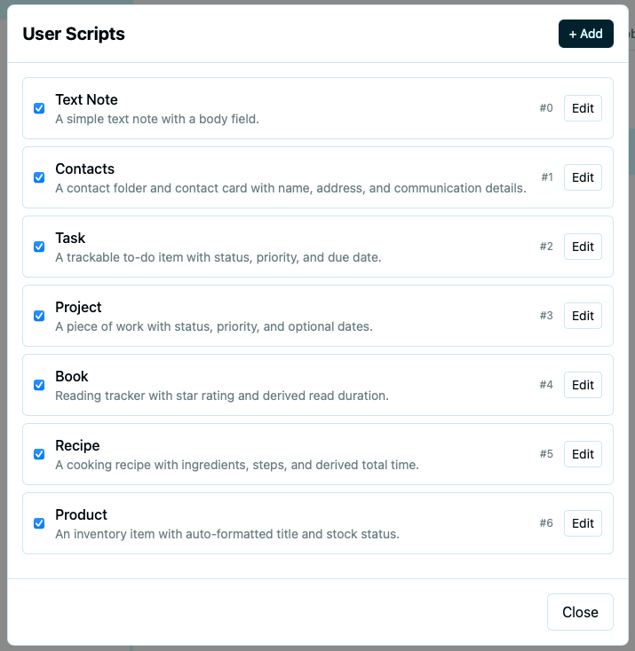

Each script shows its name and description. Click **Edit** to open its source, **+ Add** to create a new blank script, or **Import from file…** to load one from disk.

### Editing a script

Clicking **Edit** opens the script source in a built-in code editor.

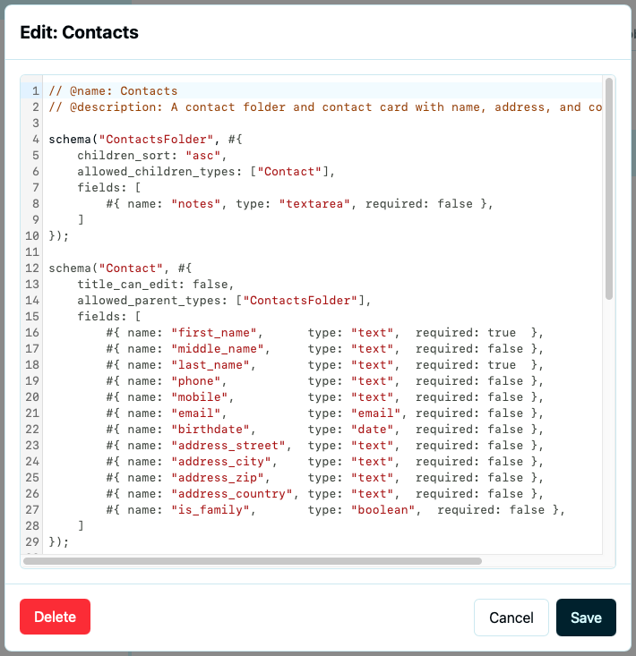

Scripts are written in [Rhai](https://rhai.rs) — a small scripting language embedded in Krillnotes. See the [Scripting Guide](/docs/scripting/) for a full reference.

---

## Themes

Krillnotes supports custom colour and typography themes. The built-in **light** and **dark** themes are always available; you can create your own alongside them.

### Managing themes

Open **Edit → Settings** and click **Manage Themes…**.

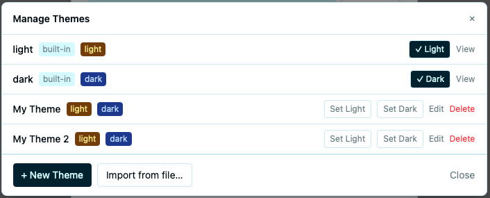

- Built-in themes cannot be edited or deleted. The active light and dark themes are marked with a checkmark.
- For each custom theme, use **Set Light** / **Set Dark** to assign it to a colour mode, **Edit** to modify it, or **Delete** to remove it.
- Click **+ New Theme** to create a theme from the default template, or **Import from file…** to load one from disk.

### Editing a theme

Themes are defined as JSON with separate `light-theme` and `dark-theme` sections. Each section can contain `colors`, `typography`, and `spacing` objects. Commented-out lines show the available keys — uncomment and adjust as needed.

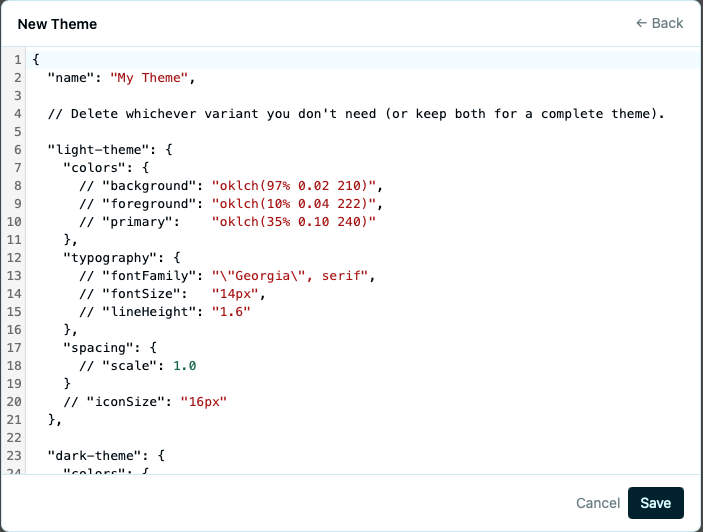

Click **Save** to apply the theme immediately.

---

## Exporting and Importing

Use **File → Export Workspace** to save a portable copy of the current workspace, and **File → Import Workspace** to restore one.

### Encryption

When exporting, you are prompted whether to protect the archive with a password.

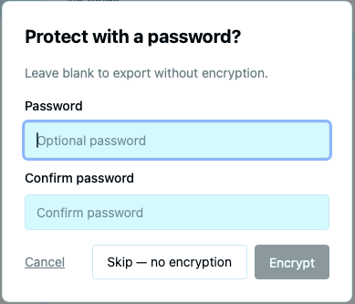

- **Skip — no encryption** — saves the export without a password.
- **Encrypt** — encrypts the export with the password you enter. You will need the same password to import it later.

### Export file format

The exported file has a `.krillnotes` extension and is a standard zip archive. You can open it with any zip tool to inspect or back up the contents directly.

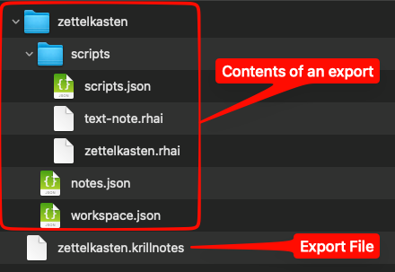

Inside the archive you will find:

- `notes.json` — all notes in the workspace.
- `workspace.json` — workspace metadata.
- `scripts/scripts.json` — script metadata.
- `scripts/*.rhai` — each script's source as a plain text file.

---

## Operations Log

Every change you make — creating notes, editing fields, moving items, modifying scripts — is recorded in an append-only operations log.

Open it via **View → Operations Log**.

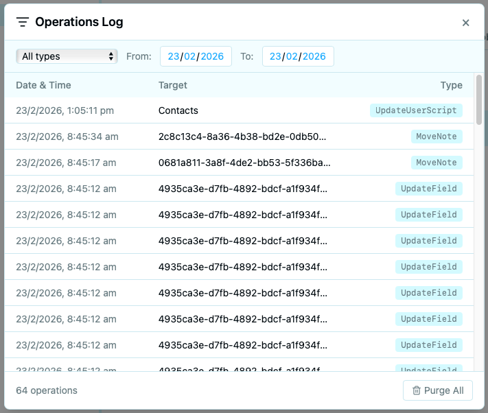

You can filter by operation type and date range. The **Purge All** button removes old entries to reclaim disk space. The log is the foundation for future undo/redo and device sync features.
