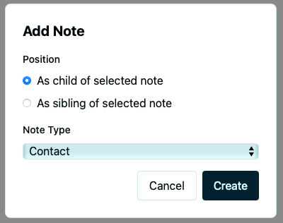

## Your First Workspace

When you launch Krillnotes for the first time, you're greeted with the welcome screen. It has one instruction: use the **File** menu to create or open a workspace.

A **workspace** is a single `.krillnotes` file on your disk — a self-contained SQLite database holding all your notes and scripts. You can have as many workspaces as you like and open multiple at once, each in its own window.

### Creating and opening workspaces

The **File** menu is where all workspace operations live.

- **New Workspace** (`⌘N`) — creates a new `.krillnotes` file in your default workspace directory.
- **Open Workspace** (`⌘O`) — opens a picker showing your recently used workspaces.
- **Export Workspace** — saves the current workspace as a `.zip` archive (notes + scripts).
- **Import Workspace** — restores a workspace from a previously exported `.zip`.

### Settings

Go to **Edit → Settings** to configure your default workspace directory. New workspaces are created here automatically.

---

## The Main Window

Once a workspace is open, the main window has two panels: the **note tree** on the left and the **detail panel** on the right.

- **Left panel** — the full tree of all notes in the workspace. Click any note to select it; the detail panel updates immediately. Use the search bar at the top to filter by title or field content.
- **Right panel** — shows the selected note. The content depends on the note type: a contacts folder shows a summary table; an individual contact shows its fields.

You can drag the divider between the two panels to resize them.

### Keyboard navigation

| Key | Action |
|-----|--------|
| `↑` / `↓` | Move between notes |
| `→` | Expand selected note |
| `←` | Collapse selected note |
| `Enter` | Edit selected note |

---

## Adding Notes

Right-click any note in the tree to open the context menu.

Choose **Add Note** to open the Add Note dialog.

**Position** controls where the new note appears:
- *As child of selected note* — nested one level deeper.
- *As sibling of selected note* — at the same level, directly below.

**Note Type** determines the fields and behaviour of the note. The dropdown lists every type defined by the workspace's scripts.

The built-in types are: **TextNote**, **ContactsFolder**, **Contact**, **Task**, **Project**, **Book**, **Recipe**, and **Product**. Scripts can define additional types.

---

## Contacts

The Contacts script provides two types that work together: a **ContactsFolder** that holds the list and renders a summary table, and individual **Contact** notes beneath it.

### Viewing contacts

Selecting the folder shows all contacts in a table with name, email, phone, and mobile.

Click any name in the table to jump directly to that contact.

### Viewing a contact

Selecting an individual contact shows all its fields in the detail panel.

The title (`Fenmark, Yuki`) is derived automatically from the `last_name` and `first_name` fields by an `on_save` hook in the Contacts script — you never type it manually.

### Editing a contact

Click **Edit** to open the edit form. All fields are editable. Required fields (`first_name`, `last_name`) are marked with a red asterisk.

Click **Save** to apply changes. The title in the tree updates immediately.

---

## Scripts

Scripts define note types and their behaviour. Each workspace has its own set of scripts stored in the database — no files to manage.

### Managing scripts

Open **Tools → Manage Scripts** to see all scripts in the current workspace.

Each script has a checkbox to enable or disable it, a load order number, and an **Edit** button. The **+ Add** button in the top-right corner creates a new blank script.

### Editing a script

Clicking **Edit** opens the script source in a built-in code editor.

Scripts are written in [Rhai](https://rhai.rs) — a small scripting language embedded in Krillnotes. See the [Scripting Guide](/docs/scripting/) for a full reference.

---

## Operations Log

Every change you make — creating notes, editing fields, moving items, modifying scripts — is recorded in an append-only operations log.

Open it via **View → Operations Log**.

You can filter by operation type and date range. The **Purge All** button removes old entries to reclaim disk space. The log is the foundation for future undo/redo and device sync features.
